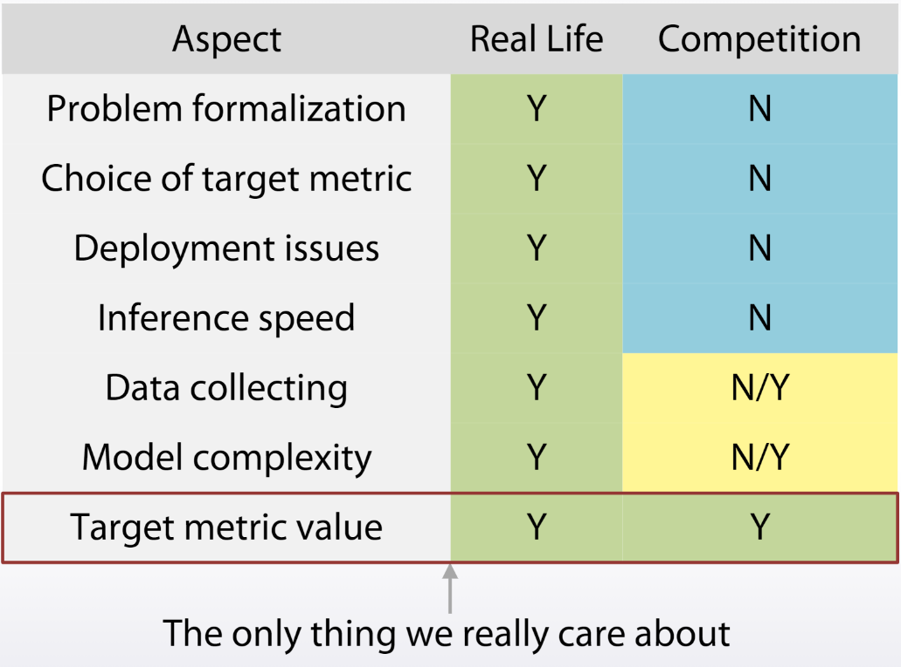

# 1. wepay preparation 
1. Power Number 

[50 powx-n](https://leetcode.com/problems/powx-n/)
``` python
class Solution(object):
    def myPow(self, x, n):
        """
        :type x: float
        :type n: int
        :rtype: float
        """
        if n == 0 and x!= 0 : return 1
        if n == 0 and x == 0:  return   
        if n>0: return x*self.myPow(x, n-1)
        if n<0: return 1.0/x*self.myPow(x, n+1)
```
(TLE on the recursion)

right solution:  
``` python
def myPow(self, x, n):
    if n == 0 and x!= 0 : return 1
    if n == 0 and x == 0:  return  
    if n < 0:
        x = 1 / x
        n = -n
    if n % 2: return x * self.myPow(x, n - 1)
    else: return self.myPow(x * x, n / 2)
```


[231 power-of-two](https://leetcode.com/problems/power-of-two/)
``` python
class Solution(object):
    def isPowerOfTwo(self, n):
        """
        :type n: int
        :rtype: bool
        """
        if n == 1: return True
        if n == 0: return False
        if n%2 == 0: return self.isPowerOfTwo(n/2)
        else: return False
```

[342. Power of Four](https://leetcode.com/problems/power-of-four/)    
[326. Power of Three](https://leetcode.com/problems/power-of-three/)    
[970. Powerful Integers](https://leetcode.com/problems/powerful-integers/) 用while的话，注意x,y 有等于1的情况   
[869. Reordered Power of 2](https://leetcode.com/problems/reordered-power-of-2/)
[233. Number of Digit One](https://leetcode.com/problems/number-of-digit-one/)


``` python
import collections
counter = collections.Counter("123345")
print(len(counter))   
>>> 5
print(counter["3"])
>>>2
```
``` python
2**3
>>>8

import numpy as np
np.power(2,3)
>>>8

import math
math.pow(2,3)
>>>8.0
```

``` python
c = Counter(m)
sum(c.values())                 # 继承自字典的.values()方法返回values的列表，再求和
max(c.values())
c.clear()                       # 继承自字典的.clear()方法，清空counter
list(c)                         # 返回key组成的list
set(c)                          # 返回key组成的set
dict(c)                         # 转化成字典
c.items()                       # 转化成(元素，计数值)组成的列表
Counter(dict(list_of_pairs))    # 从(元素，计数值)组成的列表转化成Counter
c.most_common()[:-n-1:-1]       # 最小n个计数的(元素，计数值)组成的列表
c += Counter()                  # 利用counter的相加来去除负值和0的
```


2. [lc239](https://leetcode.com/problems/sliding-window-maximum/)
[773. Sliding Puzzle](https://leetcode.com/problems/sliding-puzzle/)

```python
# 4*4的时候就需要分隔符了
        row, col = len(board), len(board[0])
        end = ''
        start = ''
        for i in range(row):
            for j in range(col):
                start += str(board[i][j])+'#'
                end += str((i * col + j + 1) % (row*col))+'#'
        if start == end: return 0
        # start search
        directions = [[0,1],[0,-1],[1,0],[-1,0]]
        visited = set(start)
        import collections
        q = collections.deque()
        q.append(start)
        step = 0
        while q:
            step += 1
            size = len(q)
            while size>0:
                s = q.popleft()
                p = s.split('#').index('0')               
                y = p / col
                x = p % col
                for i in range(4):
                    mx = x + directions[i][0]
                    my = y + directions[i][1]
                    if my<0 or mx<0 or my>=col or mx>=row: 
                        continue
                    newp = mx +my*col
                    m = list(s.split('#'))
                    print(m)
                    print([p,newp])
                    m[p],m[newp] = m[newp], m[p]
                    new = '#'.join(m)
                    if new not in visited:
                        if new == end: return step
                        visited.add(new)
                        q.append(new)
                size -= 1
        return -1
```

3. 53. Maximum Subarray

4. 65 Valid Number
```python
class Solution(object):
    def isNumber(self, s):
        """
        :type s: str
        :rtype: bool
        """
        try:
            float(s)
        except:
            return False

        return True        

```

```python

class Solution(object):
    def isNumber(self, s):
        """
        :type s: str
        :rtype: bool
        """
        s = s.strip()
        isDot, isDigit, isE = False, False, False

        for i, x in enumerate(s):
            if x == "e":
                if not isDigit or isE:  # 前面没有数字，or 前面已经存在字符 e
                    return False

                isDigit = False  # 设置isDigit = false
                isE = True
            elif x in "+-":
                if i != 0 and s[i-1] != "e":  # +- 只能出现首位，和 字符e的后面
                    return False
            elif x == ".":
                if isDot or isE:  # 字符 .（小数点）只能出现一次，而且是只能出现在 e 的前面
                    return False
                isDot = True
            elif x.isdecimal():  # 检查字符串是否只包含十进制字符
                isDigit = True
            else:
                return False

        return len(s) > 0 and isDigit  


```


# 2. data science knowledge

## problem solving process
- understanding of business problem
- problem formalization
- data collecting
- data preprocessing
- modelling
- way to evaluate model in real life
- way to deploy model




## ML model  
- linear model (LR, SVM)(into 2 subspaces)  
- Tree based (Decision Tree, Random Forest, GBDT) (split space into bexes)  
- kNN(rely on how to measure points "closeness")  
- Neural Network (smooth non-linear decision boundary)    

most powerful: GBDT nerual network

## missing values   
1. -999, -1, etc (replace with a constant)
2. mean, median
3. reconstruct value
4. remove rows with missing values
5. use a model that can deal with them out of the box(XGBoost and CatBoost)

## different data  
1. numeric  
* scaling and rank(only non-tree-based model depends on it)  
* preprocessing skills:  
  * minmaxscaler - to [0,1]  
  * standardscaler - to mean = 0, std = 1  
  * rank sets spaces between sorted values to be equal  
  * np.log(1+x) and np.sqrt(1+x)  
* 处理离群值
  * winsorization
  * np.sqrt(x)
  * np.log1p(x)  This transformation is non-linear and will move outliers relatively closer to other samples.
  * rank transform to the features
2. datetime
* periodicity
* time since
* difference between dates
3. coordinates
* interesting places
* centers of clusters
* aggregated statistics
4. categorical and ordered categorical
* label encoding
  * (maps categories to numbers)
  * (for tree based model)
  * (feature is ordinal)
  * (# of features is huge)
* frequency encoding
  * (maps categories to frequency)
  * (for tree based model)
* one-hot encoding(non tree model)
* interactions of categorical features helps the linear model and KNN

## text and image processing
* preprocessing
  * lowercase
  * stemming
  * lemmarization
  * stopwords
* bag of words  
  * TFiDF  
  * Ngrams  
* word2vec  

* text corpora 


## other 
1. [Gradient Boosting explained](http://arogozhnikov.github.io/2016/06/24/gradient_boosting_explained.html)  
2. [Decision Tree sklearn](https://scikit-learn.org/stable/modules/tree.html)  
>Advantages:  
  1. requires less effort for data preparation during pre-processing.  
  2. does not require normalization and scaling of data.    
  3. Missing valuesdoes not affect the process of building decision tree to any considerable extent.  
  4. The cost of using the tree is logarithmic in the number of data points used to train the tree. 
  5. intuitive and easy to explain, can be visualised.    
  6. Able to handle multi-output problems, a withe box model.  
>Disadvantage: 
  1. (unstable)A small change in the data can cause a large change in the structure of the decision tree.
  2. sometimes calculation can go far more complex compared to other algorithms. 
  3. often involves higher time to train the model. 
  4. relatively expensive as complexity and time taken is more. 
  (learning an optimal decision tree is known to be NP-complete under several aspects of optimality)  
  5. inadequate for applying regression and predicting continuous values.  
  6. create biased trees if some classes dominate.
  
